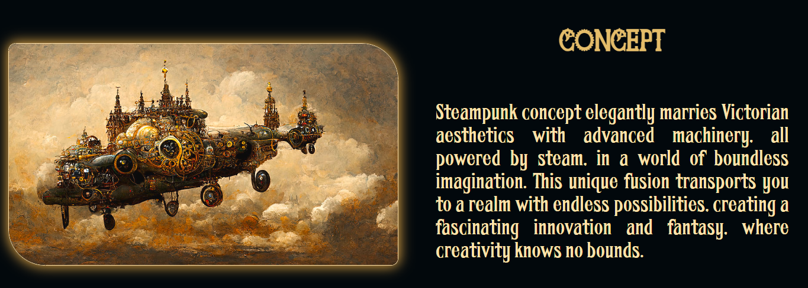
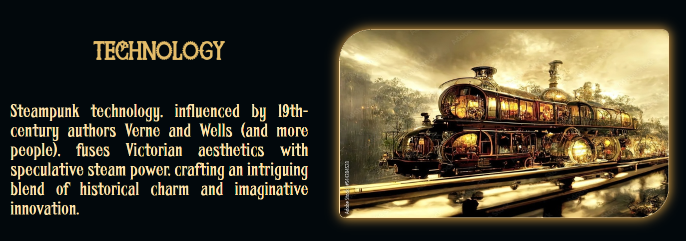
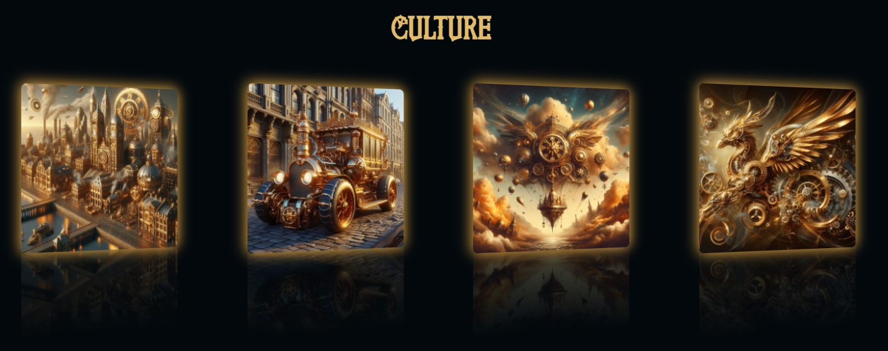
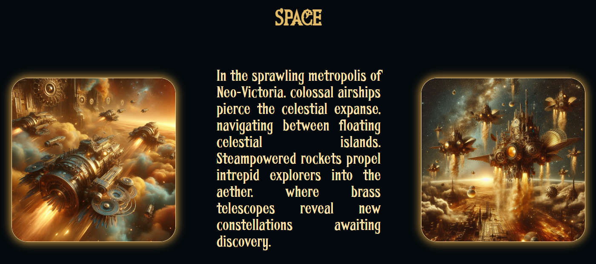

# 🎇Exploring the Steampunk's Website🎇

## Motivation for Creating the Website ⚙️

I have decided to make the Steampunk website because I like its theme, but beyond that I really like the colors that they usually use in all their machinery.

## Welcome to the Steampunk World! 🌍

### What is Steampunk? 🧭

Steampunk is an aesthetic genre that combines retro-futuristic elements, 19th-century technology, and a punk sensibility. It's a captivating subculture that has enthralled people worldwide. Our website is your gateway to this exciting universe.

### Structure - Featured Content - The website is made up of these sections 📋

- 🧭**A beautiful Hero Section**
- ⚙️ **Concept and Style:** Learn about the origins of Steampunk concept and its distinctive visual style.
   
- 🚂 **Steampunk Technology:** Explore ingenious technological creations that drive this retro-futuristic world.
   
- 🧭 **Culture:** Discover the transport methods, cars, creatures, cities and more spectacular things that have immortalized Steampunk. You'll see some cards that can show you the Steampunk power.
   
- 🚀 **Space:** Explore Steampunk's space: brass rockets, celestial gears, and Victorian cosmic dreams.
   
- 😶‍🌫️ **Footer:** Where you will find every single Credit, my Social Networks and another Navigation Bar

Thank you for exploring this fascinating retro-futuristic world, and hope that I can see you on my website!

### Fonts 🪧

Titles and Footer Navigation Bar used Jack of Gears 
Rest of the page used Fha1, both taken from 1001fonts.com

### Color palette 🌈

60% Black , 30% Golden-Orange and 10% Yellow

### Images 📷

Taken from the internet to match the color palette. The specific credits are on the website.  A lot of them are AI Generated, with DALL-E 3

### Videos 🎞️

Two famous Steampunk videos taken from Youtube

### Code Snippets 🛜

You can find them on the website credits, but here is a recapitulation: 

<b>Hero button animation:</b> Pradeepsaranbishnoi - uiverse.io

<b>Credits button animation:</b> vinodjangid07 - uiverse.io

<b>Top Nav Home Button animation:</b> oloblogger.com

<b>3D Carrousel:</b> Claudiu Lazar - codepen.io

<b>Culture cards:</b> BEN ABBESS - codepen.io

<b>JavaScript scroll, parallax, grid gallery, overlay effect and Modal Box:</b> W3Schools

*This website only has educational and practising purposes and does not seek to profit from it. Developed by David Solera Romero for the subject Lenguaje de Marcas in 1º DAM All rights reserved for the respective authors of the images and animations*
